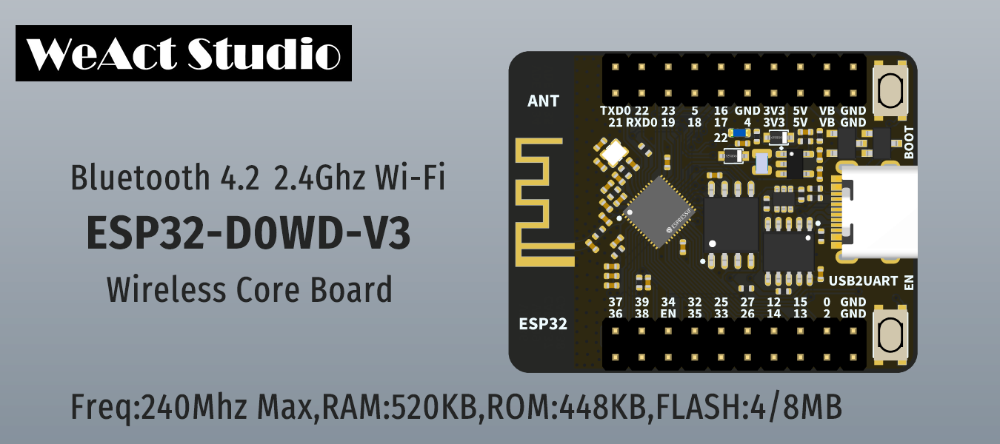

* [中文版本](./README-zh.md)
# WeActStudio.ESP32CoreBoard

ESP32-D0WD-V3
> 240Mhz Max,520KB RAM,448KB ROM,4/8MB FLASH

Espressif Official Website www.espressif.com.cn

|Dir Name|Explain|
| :--:|:--:|
|Doc|DataSheet/ReferenceManual|
|Hardware|Hardware Development Kit|
|Examples|Software Examples|
|Tools|Tools|

## How to download the program
Method
1. Decompress `esptool-v4.5.1-win64_WeActStudio.7z` in the `Tools` directory
2. Run `WeAct Studio UART Download Tool.bat`
3. Press and hold the BOOT button and connect the computer with a USB cable. Release the BOOT button
4. Drag in the program to be burned, enter the burning address and serial port number, click Enter to start burning

## ESP-IDF Use precautions
1. When the program is continuously reset, it can be downloaded normally only after entering the burning mode
2. TBD

```
/*---------------------------------------
- WeAct Studio Official Link
- taobao: weactstudio.taobao.com
- aliexpress: weactstudio.aliexpress.com
- github: github.com/WeActTC
- gitee: gitee.com/WeAct-TC
- blog: www.weact-tc.cn
---------------------------------------*/
```